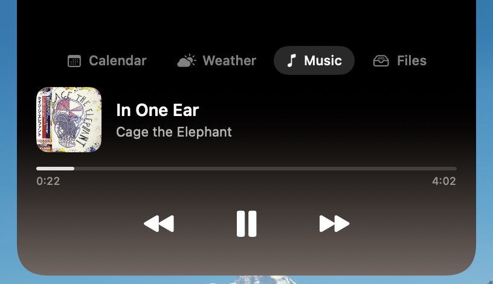
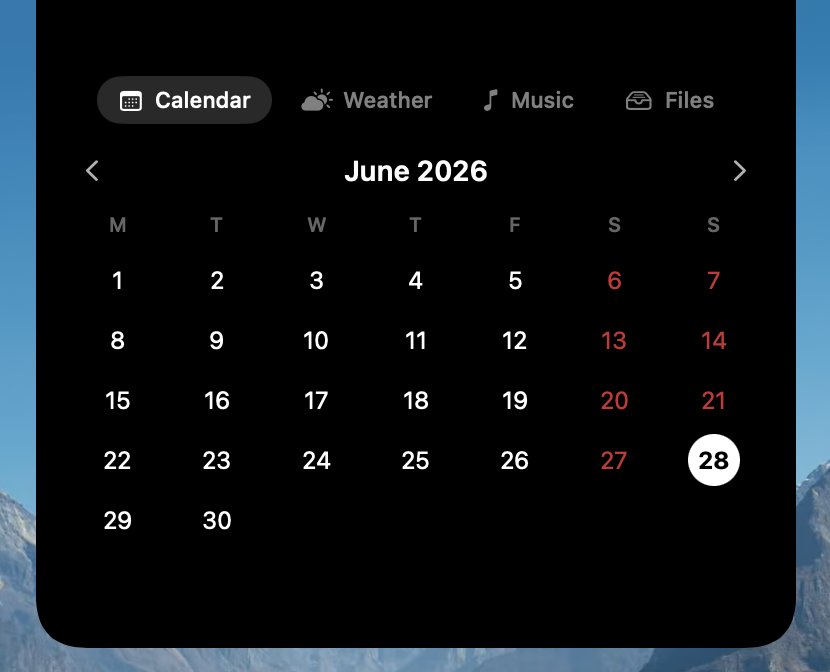
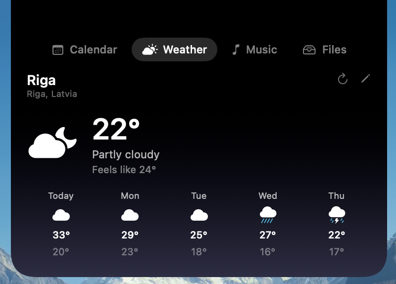
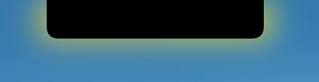
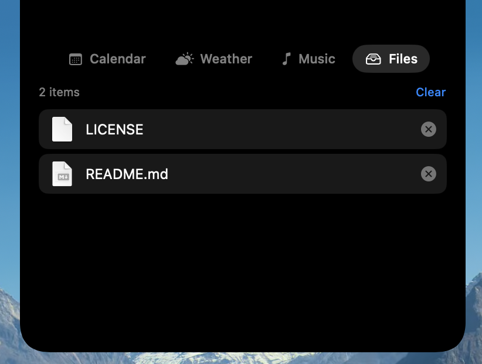
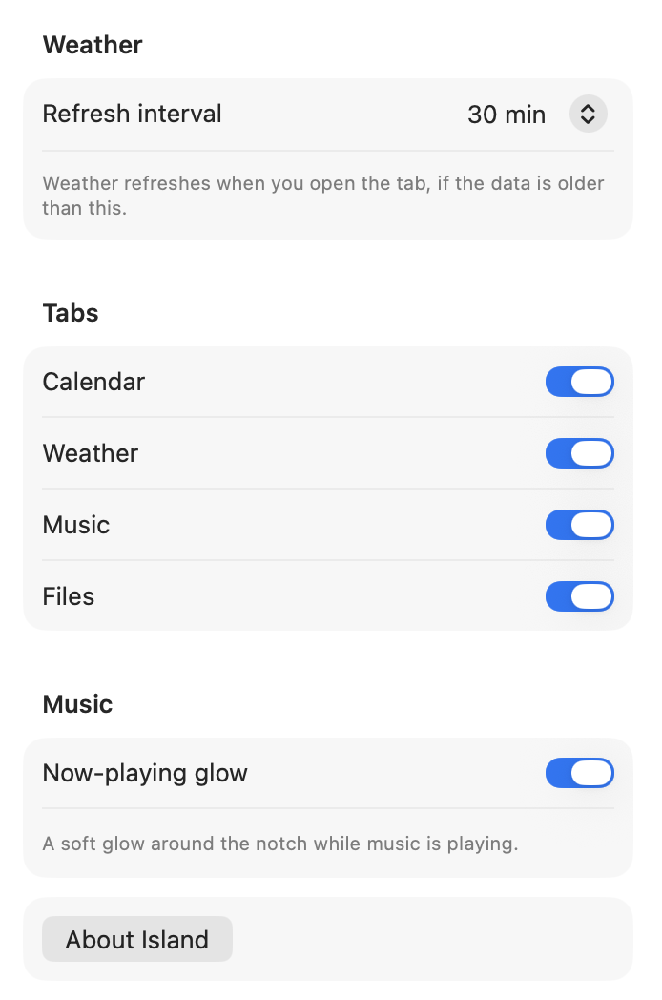

# 🏝️ Island

A minimal, personal **Dynamic Island for macOS** — only the features I actually use.

It sits quietly on the notch, blends in at rest, and expands on hover into a small
tabbed hub: calendar, weather, Apple Music, and a drag-and-drop file shelf. Native
Swift, no full Xcode required.

<p align="center">
  
</p>

---

## Features

### 📅 Calendar
A clean month grid — Monday-first, today highlighted, weekends in red.

<p align="center">
  
</p>

### 🌤️ Weather
Current conditions and a 5-day forecast from [Open-Meteo](https://open-meteo.com)
(no API key). Type to pick your city; it's remembered. Refresh by hand any time,
and the background gently tints to match the weather.

<p align="center">
  
</p>

### 🎵 Music
Apple Music now-playing — artwork, title, a live progress bar, and transport
controls. The island tints itself from the album artwork, and a soft **glow
breathes around the notch while music plays**, even when collapsed.

<p align="center">
  
</p>

### 🗂️ Files — drag & drop shelf
A temporary staging area for files: drop them on the shelf, then drag them out
somewhere else later (they stay until you remove them). The shelf references your
files — it never copies them.

And the magic: **drag a file toward the notch and the island opens to catch it**.
Drag one back out and it slips out of the way so the drop lands where you mean it.

<p align="center">
  
</p>

### ⚙️ Settings
A small Settings window (menu-bar item, or ⌘,): the weather refresh interval,
which tabs to show, and whether the now-playing glow appears.

<p align="center">
  
</p>

Under the hood there's a fluid spring open/close morph, a per-tab adaptive height
so the island hugs each tab's content, a sliding tab capsule, and a shared theme.

---

## Requirements

- A Mac running **macOS 14+** (built and used on a MacBook Air M4, macOS Tahoe).
  On a notchless display it falls back to a floating pill at the top-center.
- The **Swift toolchain** — installed with the Xcode Command Line Tools
  (`xcode-select --install`). Full Xcode is not needed.
- The Music tab asks for **Automation** permission once, so it can read and
  control Apple Music.

## Build & run

```sh
./run.sh          # build + (re)launch
./build.sh        # build the .app bundle only
```

Island runs as a menu-bar agent (no Dock icon). A small icon appears in the menu
bar — use it to open **Settings…** or **Quit**.

## License

MIT — see [LICENSE](LICENSE).

Made by **katemptiness** & **Claude** 💙
